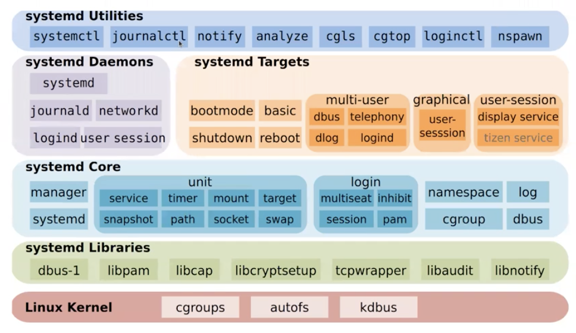

# systemd



## Documentation

```
systemctl --all | grep systemd
```

https://freedesktop.org/wiki/Software/systemd

## Unit Types

`.target` - groups other units

`.service` - demon analogue

`.timer` - cron analogue

`.device` - fact of device connection (sysfs device name)

`.mount` - file system mount point

`.automount` - automount point (*.mount)

`.socket` - launching a unit when connected to the specified socket (default - *.service)

`.path` - launching a unit on a path access event (default - *.service)

`.slice` - groups other units in the cgroups tree

`.swap` - swap management (*.device)

`.snapshot` - service snapshots

`.scope` - areas defined systems

## Directories

`/etc/systemd/` - configurations

`/etc/systemd/system` - administrator unit-files

`/etc/systemd/system/*.wants/` - `systemctl enable` symlinks

## Targets 

`poweroff.target` 0 - halt

`rescue.target` 1 - single user

`multi-user.target` 2 - multiuser w/o network, 3 - full multiuser

`graphical.target` 5 - X11 GUI

`reboot.target` 6 - reboot

